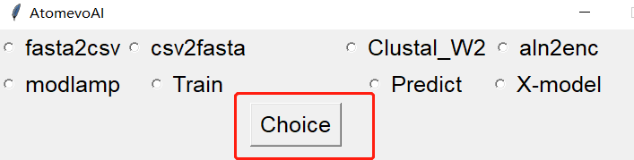
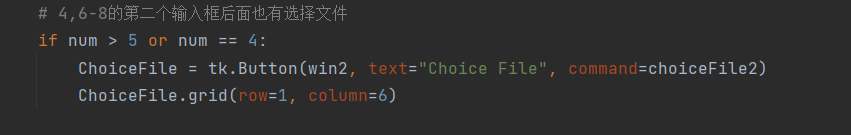

# AtomevoAI_GUI页面编写及spec文件打包记录
## 目录
> Atomevo_GUI
> 1. 主页面与模块页面
> 2. 模块选择与页面跳转的实现
> 3. 模块的运行
> 4. 脚本参数获取方式修改与参数传递
>
> spec文件打包
> 1. pyinstaller第一次打包
> 2. spec文件内参数修改
>
## Atomevo_GUI
### 1.主页面与模块页面
> 页面编写方法和之前的差不多，就不这么详细的讲解编写的过程了
> 这里主要讲怎么在model_gui里面一次性编写好所有的页面，在主页面选择后能够指向需要的module页面
- #### 两个页面都有的
- tkinter库编写的gui页面分辨率会非常的低，让人看得很难受，这段可以让页面变得清晰
>
******************************
- #### 主页面
- 这段实现的是多选按钮，让所有选项都能显示出来
- 在site中，以list+tuple的形式储存多选按钮的名字，序号
- 我通过其对应的序号进行按钮的排列
- 首先用Radiobutton实现多选按钮
- 然后写一个if，实现前四个在第一行，后四个在第二行，每行前两个选项在左边，其余在右边
> 
> 
- 点击按钮触发对应的def，然后页面跳转
>
>
******************************
- #### module页面
- > module页面的实现相较于主页面多内容一点，主要是多在要一个文件将所有的module页面全部实现，但是也仅限于内容上面，思路其实并不复杂，我感觉是有比较大的优化空间的，目前主要先实现功能，就先不优化了

- ##### 首先是组件的内容
- 展示一个有最多输入内容的，这样子好理解
>

- ===========================================
- 每一个模块都至少有两个输入框，第一个必然需要选择输入文件
>

- 接下来是第二个输入文件按钮与后续输入框
- 序号为4，6-8的模块，需要在第二个输入框传入文件
- > 其实第三个clustal_w也是需要有一个按钮来选择路径的，但是我是后面test的时候才发现他也可能也有需要，所以我将他写在了后面，还有就是他需要触发不一样的方法，在优化的时候要重新写一个if，但是也可以实现这一块代码的优化，至少else里面嵌套的if不会这么繁琐难看
>

- 只有1，4号后续没有输入框了，所以他们两个直接pass，然后定义row_ = 1，这个row_的作用在后面再讲
- 除去1，4后，剩余所有模块均有第三个输入框 row_ = 2
- 序号2，8的模块还有第四个输入框，row_ = 4
- > 前面讲的clustal_w可以优化的在这里，因为我在这段还有一句话要显示，所以row_ = 3
>

- 点击后运行
> 

- ##### 接下来讲怎么实现Label内容显示的区别
- 这个和在服务器上面的有点相似，将需要显示的内容全部放在一个list里面，通过判断需要显示哪个模块就显示对应的Input_[]的内容
> 

- ##### 最后是button功能的实现
- 点击button后，按照command执行对应的def
- 使用tkinter的filedialog实现文件选择
- set将选择文件的路径显示在Entry中
> 

### 2.模块选择与页面跳转的实现
- 在第一部分实现多按钮选择的时候，写了site，而这个site中的序号为页面跳转的提供了对应的信息，同时还为module页面显示不同页面内容提供num以实现功能
> 

- 首先用v.get来获取序号
> v是在tk.IntVar()中定义的
- 然后更改管道，实现print内容输出到choice.txt中，在choice里面写入选择的序号
> 感觉写入文件的写法也可以改改（？以后再看看，现在这个方法挺稳定的
- 接下来，import module_gui.py实现页面跳转，同时，使用.main()来动态调用第二个页面，实现第二个页面能够多次打开，关闭
> 

- 将module_gui的所有内容写入def main(win)中，以实现主程序能调用他
> .png)

- 在module_gui中打开choice.txt，然后通过传递的值，得到num，定义一个list，里面有所有模块的名字，顺序与site一致，得到模块名字，从而实现切换页面后title名字的改变
- 而num也被利用在了显示不同Label内容中，判断并显示需要展示多少组件，通过显示不同的Label，组件，实现了不同模块页面的显示
> 

### 3.模块的运行
> 模块运行的方式其实和打开module_gui.py的方式很相似，都是将脚本整体写入main函数中，在需要的时候调用对应的main函数
- 通过前面得到的num，确定需要调用的模块，用import和main()来实现多次运行
> 

### 4.脚本参数获取方式修改与参数传递
> 以clustal_w为例，因为他有其他模块都有的，自己还多出了选择路径
- ##### 首先是在module_gui.py部分
- 使用get的方式获取每个输入框的内容
- 依旧采用文件写入的方式实现参数传递，将得到的文件路径，参数写入enter.txt中
> 
> - 注：clustal_w还将获取其安装路径，将其写入route.txt中
> 

- ##### 接下来是各脚本的参数获取
> 依旧是以clustal_w为例
- 读取enter.txt，将里面所有内容以list的形式保存到enterA中，在使用相关参数的时候放入对用的参数即可
- clustal_w的路径获取原理也是一样，读取对应的txt，保存到list，使用
> 
> 
>
## spec文件
### 1.pyinstaller第一次打包
- 在使用pyinstaller打包后，将生成dist，bulid文件夹，spec文件
- -D打包后依赖文件会独立出来，打开exe运行速度更快
- -F打包后所有依赖文件都会在exe中，打开exe运行速度较慢
- -w 隐藏cmd，这个可以在spec文件修改参数实现
- --add-binary=x;x 打包pyinstaller无法直接整和的库，可以先将库的文件夹复制进项目文件夹中，可以在spec文件中修改参数实现
- –hidden-import 打包需要打包，但是没有打包进来的包，可以在spec文件中修改实现

### 2.spec文件内参数修改
- 主要讲我修改过的
- 第一个[]中填写所有调用到的py文件
- pathex填写脚本，我之前想把script的路径写进去，上面可以写少一点，但是好像失败了，所以我最后还是在上面直接写要打包文件的绝对路径
- datas 对应--add-binary=x;x，xgboost需要使用这个，shap库打包后会出现文件丢失的情况，所以我也将他放了进去让他额外导入一份
- hiddimports 主要看打包过程显示丢失了那些，其中sklearn需要填写，numpy在打包后丢失，需要在这里重新导入
- 

- True将显示cmd，False隐藏，测试的时候一定要打开，这样才能看到报错信息
- 